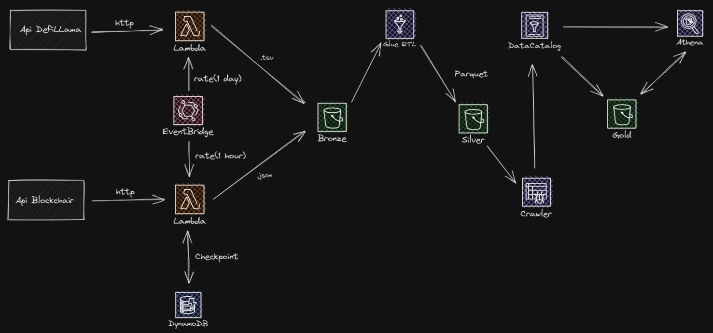

# ⛓️Blocklake

Blocklake is a project that aims to unify different data from different sources related to blockchains. [Blockchair](https://blockchair.com/) and [DeffiLamma](https://defillama.com/docs/api) APIs were used as source, which provide block data, transactions, address information and protocol data (Defi, Yields, DEXs) such as TVL, % yielsftretrtds, liquidations. The data pipeline architecture was designed and developed entirely on AWS.



### 🛠 Tools

- [AWS Lambda](https://aws.amazon.com/lambda/)
- [AWS EventBridge](https://aws.amazon.com/eventbridge/)
- [AWS Glue](https://aws.amazon.com/glue/)
- [AWS DynamoDB](https://aws.amazon.com/dynamodb/)
- [AWS S3](https://aws.amazon.com/s3/)
- [AWS Athena](https://aws.amazon.com/athena/)

### 📐 Deploy Serverless Lambda

Open the functions folder and choose a package to upload to lambda.
```
$ cd lambda/{package_name}
```

In order to deploy the example, you need to run the following command:

```
$ serverless deploy
```

After running deploy, you should see output similar to:

```bash
Deploying aws-python-project to stage dev (us-east-1)

✔ Service deployed to stack aws-python-project-dev (112s)

functions:
  hello: aws-python-project-dev-hello (1.5 kB)
```

### Local development

You can invoke your function locally by using the following command:

```bash
serverless invoke local --function hello
```

Which should result in response similar to the following:

```
{
    "statusCode": 200,
    "body": "{\"message\": \"Go Serverless v3.0! Your function executed successfully!\", \"input\": {}}"
}
```

### Bundling dependencies

In case you would like to include third-party dependencies, you will need to use a plugin called `serverless-python-requirements`. You can set it up by running the following command:

```bash
serverless plugin install -n serverless-python-requirements
```

Running the above will automatically add `serverless-python-requirements` to `plugins` section in your `serverless.yml` file and add it as a `devDependency` to `package.json` file. The `package.json` file will be automatically created if it doesn't exist beforehand. Now you will be able to add your dependencies to `requirements.txt` file (`Pipfile` and `pyproject.toml` is also supported but requires additional configuration) and they will be automatically injected to Lambda package during build process. For more details about the plugin's configuration, please refer to [official documentation](https://github.com/UnitedIncome/serverless-python-requirements).


## 📝 License

Licensed under the [MIT License](./LICENSE).